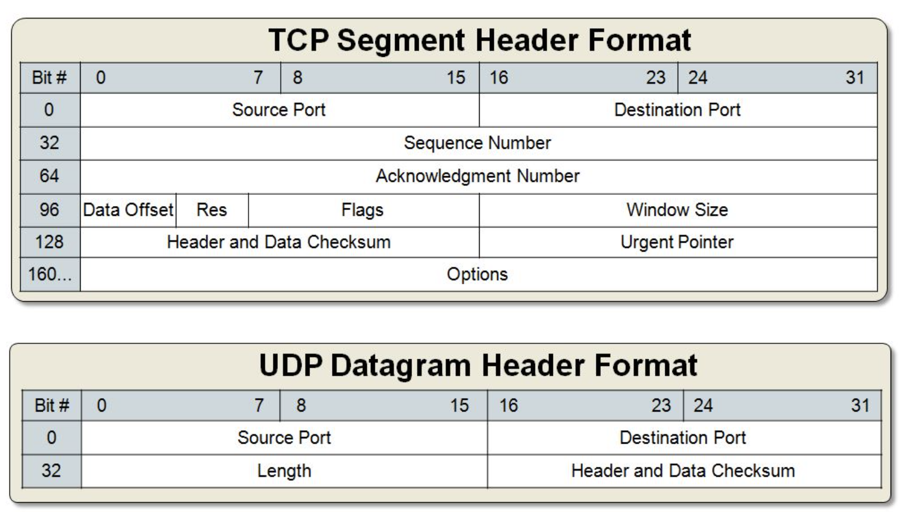

- Many kinds of sockets, but we're going to be dealing with: "DARPA Internet addresses (Internet Sockets)".
- Two types of Internet Sockets we're learning: "Stream Sockets" and "Datagram Sockets" which will hereafter
  be referred to SOCK_STREAM and SOCK_DGRAM.
- Stream sockets are reliable two-way connected communication streams.
- Telnet and ssh apps both use stream sockets.
- Web browsers use HTTP which uses stream sockets to get pages. If you telnet to a web site on port 80 and type
  "GET / HTTP/1.0" and hit RETURN twice, it’ll dump the HTML back at you.
- If you output two items into the socket in the order "1, 2", they will arrive in the order "1, 2" at the opposite
  end. They will also be error-free.
- They achieve this high level of data transmission quality using a protocol called "The Transmission Control Protocol" (TCP).

- Datagram Sockets use User Datagram Protocol (UDP). If you send a datagram, it may arrive. It may arrive out
  of order. If it arrives, the data within the packet will be error-free.
- Datagram Sockets are connectionless because you don’t have to maintain an open connection as you do with stream sockets.
  You just build a packet, slap an IP header on it with destination information, and send it out.
- Why would you use an unreliable underlying protocol? Two reasons: speed and speed. It’s way faster to fire-and-forget
  than it is to keep track of what has arrived safely and make sure it’s in order and all that. If you’re sending chat
  messages, TCP is great; if you’re sending 40 positional updates per second of the players in the world, maybe it
  doesn’t matter so much if one or two get dropped, and UDP is a good choice.

- Data encapsulation:
  - Basically, it says this: a packet is born, the packet is wrapped ("encapsulated") in a header (and rarely a footer)
    by the first protocol (say, the TFTP protocol), then the whole thing (TFTP header included) is encapsulated again by
    the next protocol (say, UDP), then again by the next (IP), then again by the final protocol on the hardware (physical)
    layer (say, Ethernet).
  - When another computer receives the packet, the hardware strips the Ethernet header, the kernel strips the IP and UDP
    headers, the TFTP program strips the TFTP header, and it finally has the data.

- Layered Network Model (aka "ISO/OSI")
  - Application
  - Presentation
  - Session
  - Transport
  - Network
  - Data Link
  - Physical
- That is a bit generic, so a layered model more consistent with Unix might be something like:
  - Application Layer (telnet, ftp, etc.)
  - Host-to-Host Transport Layer (TCP, UDP)
  - Internet Layer (IP and routing)
  - Network Access Layer (Ethernet, wi-fi, or whatever)

- Originally we had "The Internet Protocol Version 4" (IPv4). It had addresses made up of four bytes (A.K.A. four "octets").
  This offered billions of addresses which at the time seemed like an impossibly large number. Now everything from computers,
  cell phones, calculators, and puppy dogs have one. Also some big organizations generously allocated millions of IP addresses
  for their own use. Such as Xerox, MIT, Ford, HP, IBM, GE, AT&T, Apple, to name a few.

- Subnets:
  - For organizational reasons, it’s sometimes convenient to declare that "this first part of this IP address up through this
    bit is the network portion of the IP address, and the remainder is the host portion."
  - For instance, with IPv4, you might have 192.0.2.12, and we could say that the first three bytes are the network and the
    last byte was the host. Or, put another way, we’re talking about host 12 on network 192.0.2.0 (see how we zero out the
    byte that was the host).
  - The network portion of the IP address is described by something called the netmask, which you bitwise-AND with the IP
    address to get the network number out of it. The netmask usually looks something like 255.255.255.0. (E.g. with that
    netmask, if your IP is 192.0.2.12, then your network is 192.0.2.12 AND 255.255.255.0 which gives 192.0.2.0.).
  - But it’s a bit unwieldy to use a big string of numbers like 255.192.0.0 as a netmask. First of all, people don’t have
    an intuitive idea of how many bits that is, and secondly, it’s really not compact. So the New Style came along, and it’s
    much nicer. You just put a slash after the IP address, and then follow that by the number of network bits in decimal.
    Like this: 192.0.2.12/30

- Port Numbers:
  - 16-bit number that’s like the local address for the connection. Think of the IP address as the street address of a
    hotel, and the port number as the room number.
  - Ports under 1024 are often considered special, and usually require special OS privileges to use.

- Byte Order:
  - Given a two-byte hex number, say b34f:
    - Big Endian: stored in two sequential bytes `b3` followed by `4f` (the number is stored with the big end first)
    - Little Endian: stored in two sequential bytes `4f` followed by `b3` (the number is stored with the little end first)
  - Big Endian is also referred to as "Network Byte Order" because that’s the order us network types like.
  - Basically, you’ll want to convert the numbers to Network Byte Order before they go out on the wire, and convert
    them to Host Byte Order as they come in off the wire.

- TCP and UDP header formats:


```
--------------------------------------------------------------------
Reference addrinfo struct with some details

struct addrinfo {
  int              ai_flags;     // AI_PASSIVE, AI_CANONNAME, etc.
  int              ai_family;    // AF_INET, AF_INET6, AF_UNSPEC
  int              ai_socktype;  // SOCK_STREAM, SOCK_DGRAM
  int              ai_protocol;  // use 0 for "any"
  size_t           ai_addrlen;   // size of ai_addr in bytes
  struct sockaddr *ai_addr;      // struct sockaddr_in or _in6
  char            *ai_canonname; // full canonical hostname
  struct addrinfo *ai_next;      // linked list, next node
};
--------------------------------------------------------------------
Order of system calls for the TCP server:

getaddrinfo();
socket();
bind();
listen();
accept()
--------------------------------------------------------------------
```